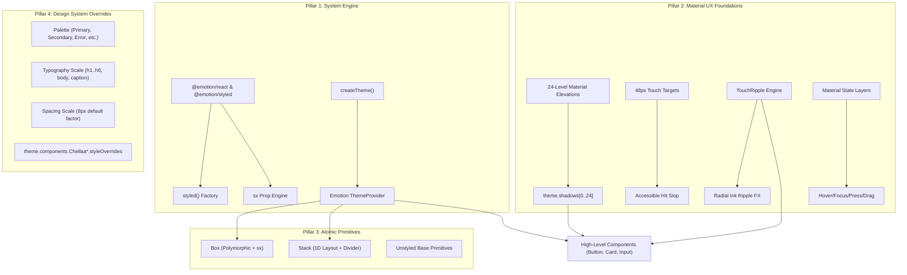

# Architecture Decision & Specification: MUI-Grade Emotion Engine & Google Material System

**Document Status:** Approved Architecture Plan  
**Target Package:** `@chellaa/react`  
**Governing Strategy:** Material UI (MUI) Emotion Runtime Engine + Google Material Design 3 (M3) UX Focus  

---

## 1. Executive Summary & Architectural Motivation

To elevate `@chellaa/react` into a truly high-level, enterprise-grade component library capable of matching and exceeding **Material UI (MUI)**, we are redesigning the foundational styling engine and UX system from the ground up:

1. **Styling Engine**: Migrating to an **Emotion-powered CSS-in-JS runtime engine** (`@emotion/react`, `@emotion/styled`), featuring the full power of dynamic `styled()` component factories, `sx` prop theme-path resolution, and zero-conflict scoped CSS.
2. **UX Focus (Google Material Design Specs)**:
   - **Tactile Elevations**: Authentic 24-level elevation shadow system computed from key light (`umbra`), ambient light (`penumbra`), and outline (`ambient`) shadows.
   - **Touch-Friendly Ergonomics**: Strict 48x48px minimum touch targets with accessible hit area expansion.
   - **Hardware-Accelerated TouchRipple**: Smooth, GPU-composited radial ink ripples expanding from the exact touch/click point.
   - **State Layer Opacities**: Standardized Material state layers (hover 4%, focus 12%, pressed 12%, dragged 16%).
3. **DOM Composition**: Atomic primitives (`Box`, `Stack`) serving as the universal polymorphic building blocks for all complex components, eliminating unnecessary DOM node pollution.
4. **Design System Extensibility**: A robust `ThemeProvider` with deep theme inheritance, dynamic palette mode switching (`light` / `dark`), and granular component-level style overrides (`theme.components.ChellaaButton.styleOverrides`).

---

## 2. The 4 Core Architectural Pillars



---

## 3. Pillar 1: Styling Engine & `sx` Prop Specification

### 3.1 Custom `styled` Factory
A wrapper around `@emotion/styled` that automatically injects the Chellaa theme and handles `shouldForwardProp`:

```typescript
import styledEmotion from "@emotion/styled";
import { ChellaaTheme } from "../theme";

export interface StyledOptions {
  name?: string;
  slot?: string;
  shouldForwardProp?: (prop: PropertyKey) => boolean;
}

export function styled<T extends React.ElementType>(
  component: T,
  options?: StyledOptions
) {
  // Filters out framework-specific props (e.g. sx, ownerState) from the DOM
  return styledEmotion(component, {
    shouldForwardProp: (prop) =>
      prop !== "sx" &&
      prop !== "ownerState" &&
      (options?.shouldForwardProp ? options.shouldForwardProp(prop) : true),
  });
}
```

### 3.2 The `sx` Prop Parser
The `sx` prop allows consumers to define styles using shorthand theme paths directly on any component:

- **Spacing**: `sx={{ p: 2, m: 1 }}` maps to `theme.spacing(2)` (`16px`) and `theme.spacing(1)` (`8px`).
- **Colors**: `sx={{ bgcolor: 'primary.main', color: 'text.primary' }}` maps to `theme.palette.primary.main`.
- **Borders & Radii**: `sx={{ borderRadius: 2, border: 1, borderColor: 'divider' }}`.
- **Elevations**: `sx={{ boxShadow: 4 }}` maps to `theme.shadows[4]`.
- **Responsive Breakpoints**: Object and array syntax:
  ```tsx
  <Box sx={{ width: { xs: '100%', sm: '50%', md: '33.3%' }, p: [1, 2, 4] }} />
  ```

---

## 4. Pillar 2: Google Material UX & Tactile Elevations

### 4.1 The 24-Level Elevation Shadow Matrix
Google Material Design defines 24 distinct elevation levels generated by layering three box-shadows:
1. **Umbra** (Key shadow: direct light source)
2. **Penumbra** (Ambient light source)
3. **Ambient** (Atmospheric fill light)

```typescript
export function createShadow(elevation: number): string {
  if (elevation === 0) return "none";
  // Exact Material Design shadow formulas for elevations 0-24
  return [
    `${umbra[elevation]} rgba(0,0,0,0.2)`,
    `${penumbra[elevation]} rgba(0,0,0,0.14)`,
    `${ambient[elevation]} rgba(0,0,0,0.12)`,
  ].join(", ");
}
```

### 4.2 Hardware-Accelerated `TouchRipple`
The authentic Material ink ripple provides immediate tactile feedback:
- Listens for pointer down / mouse down / touch start events.
- Calculates pointer coordinates relative to the trigger element's bounding rect.
- Calculates diameter as the hypotenuse from touch point to farthest corner.
- Animates a radial CSS transform (`scale(0)` -> `scale(1)`) with `opacity: 0.3` fading to `0`.
- Provides full keyboard support (`Enter`, `Space`) with center-origin expansion.

### 4.3 Touch-Friendly Hit Targets
- Minimum touch target: `48px` x `48px` for all interactive elements on touch screens (`@media (pointer: coarse)`).
- Visual elements can be compact (e.g. `32px` button), while using pseudo-elements (`::after`) to expand the hit slop transparently to `48px`.

---

## 5. Pillar 3: Atomic DOM Composition Primitives

### 5.1 `Box` Primitive
The universal polymorphic element powered by Emotion:

```tsx
<Box
  component="section"
  sx={{
    p: 3,
    bgcolor: "background.paper",
    borderRadius: 2,
    boxShadow: 3,
    "&:hover": { boxShadow: 6 },
  }}
>
  Elevated Material Card
</Box>
```

### 5.2 `Stack` Primitive
1D layout container:
- `direction`: `"row" | "row-reverse" | "column" | "column-reverse"`.
- `spacing`: Numeric token or responsive array (`spacing={{ xs: 1, sm: 2, md: 3 }}`).
- `divider`: Semantic separator component inserted between every child element.
- `alignItems` & `justifyContent`: Flexbox alignment helpers.

---

## 6. Pillar 4: Design System Extensibility & Theme Overrides

### 6.1 Master Theme Structure (`ChellaaTheme`)

```typescript
export interface ChellaaTheme {
  palette: {
    mode: "light" | "dark";
    primary: PaletteColor;
    secondary: PaletteColor;
    error: PaletteColor;
    warning: PaletteColor;
    info: PaletteColor;
    success: PaletteColor;
    text: { primary: string; secondary: string; disabled: string };
    background: { default: string; paper: string; surface: string };
    divider: string;
    action: {
      active: string;
      hover: string;
      hoverOpacity: number;
      selected: string;
      selectedOpacity: number;
      disabled: string;
      disabledBackground: string;
      focus: string;
      focusOpacity: number;
    };
  };
  typography: TypographyTheme;
  spacing: (factor: number | string) => string;
  shape: { borderRadius: number };
  breakpoints: Breakpoints;
  shadows: string[]; // 25 elevation strings (0 to 24)
  transitions: Transitions;
  zIndex: ZIndex;
  components?: {
    [ComponentName in string]?: {
      defaultProps?: Record<string, any>;
      styleOverrides?: {
        [slotName: string]:
          | React.CSSProperties
          | ((params: { theme: ChellaaTheme; ownerState: any }) => React.CSSProperties);
      };
    };
  };
}
```

---

## 7. Migration & Implementation Phasing

```
[Phase 1: Dependencies & Engine Core]
  ├── Add @emotion/react, @emotion/styled, clsx
  ├── Implement createTheme(), defaultTheme, ThemeProvider, useTheme()
  └── Implement 24-level elevation shadows & 8px spacing engine

[Phase 2: Material UX Primitives]
  ├── Implement TouchRipple component & useRipple hook
  └── Implement sx prop processor & styled factory

[Phase 3: Atomic Layout Primitives]
  ├── Implement Box component with component/as polymorphism and sx
  └── Implement Stack component with direction, spacing, and divider

[Phase 4: Component Material Overhaul]
  ├── Upgrade Button: Contained (elevated), Outlined, Text variants
  ├── Add TouchRipple, elevation prop, and ownerState
  └── Add theme.components.ChellaaButton styleOverrides support

[Phase 5: Verification & Testing]
  ├── Run Vitest unit & accessibility tests
  └── Verify Storybook workbench & Docs portal
```
