# Specification & Implementation Blueprint: Emotion-Powered Material Design Engine

**Document Status:** Approved Architecture Blueprint  
**Phase:** System Redesign & Modernization  
**Target Package:** `@chellaa/react`  
**Governing Architecture:** Material UI (MUI) & Google Material Design 3 (M3) Specifications  

---

## 1. Executive Summary & Architecture Paradigm

This specification defines the complete architectural transition of `@chellaa/react` from a zero-runtime static CSS custom properties model (`--cl-*`) to an **Emotion-powered, Material UI-style dynamic CSS-in-JS design system engine**.

### Core Architecture Tenets

1. **Styling Engine**: Powered by `@emotion/react` and `@emotion/styled`, providing a type-safe `styled()` factory and an ergonomic, responsive `sx` prop engine with zero manual CSS files required.
2. **Google Material UX Focus**:
   - **24-Level Elevation Shadow Matrix**: Precise optical depth calculated from composite Umbra, Penumbra, and Ambient light sources.
   - **Hardware-Accelerated `TouchRipple`**: Authentic radial ink ripple animations with touch-point detection and keyboard support.
   - **Accessible Touch Targets**: Strict 48px hit slop for touch screens (`@media (pointer: coarse)`).
   - **Standardized State Layers**: Explicit opacity overlays for hover (4%), focus (12%), pressed (12%), and dragged (16%) interactions.
3. **DOM Composition**: Atomic primitives (`Box`, `Stack`) serving as the universal polymorphic building blocks for all complex components, eliminating unnecessary DOM node pollution.
4. **Design System Extensibility**: A robust `ThemeProvider` with deep theme inheritance, dynamic palette mode switching (`light` / `dark`), and granular component-level style overrides (`theme.components.ChellaaButton.styleOverrides`).

---

## 2. Architectural Blueprint Diagram

```mermaid
graph TD
    subgraph "Layer 1: Theme & Tokens Engine"
        CreateTheme["createTheme(options)"] --> MasterTheme["ChellaaTheme Context"]
        MasterTheme --> Palette["Palette (light/dark, primary, surface)"]
        MasterTheme --> Shadows["24-Level Shadows (Umbra/Penumbra/Ambient)"]
        MasterTheme --> Spacing["8px Spacing Function: theme.spacing()"]
        MasterTheme --> Typography["Typographic Scale & Font Weights"]
        MasterTheme --> Breakpoints["Responsive Breakpoints (xs, sm, md, lg, xl)"]
        MasterTheme --> Overrides["theme.components.*.styleOverrides"]
    end

    subgraph "Layer 2: System Styling Engine"
        EmotionStyled["@emotion/styled"] --> CustomStyled["styled(Component, options)"]
        EmotionReact["@emotion/react"] --> SxParser["sx Prop Engine"]
        MasterTheme --> SxParser
        MasterTheme --> CustomStyled
        ShouldForward["shouldForwardProp Filter"] --> CustomStyled
    end

    subgraph "Layer 3: Material UX Primitives"
        TouchRipple["TouchRipple Engine"] --> PointerStart["Pointer Down / Touch Origin Calculation"]
        TouchRipple --> GPUAnim["GPU Transform Scale(0->1) + Opacity Fade"]
        TouchTarget["48px Touch Target Hit-Slop (WCAG)"]
        StateLayers["M3 State Layers (hover 4%, focus 12%, press 12%)"]
    end

    subgraph "Layer 4: Atomic Layout Primitives"
        CustomStyled --> Box["Box (Polymorphic component/asChild + sx)"]
        CustomStyled --> Stack["Stack (1D Layout + Spacing + Dividers)"]
    end

    subgraph "Layer 5: High-Level UI Components"
        Box --> Button["Button (Contained, Outlined, Text + Elevation)"]
        TouchRipple --> Button
        Box --> Card["Card, Paper, Surfaces"]
        Box --> FormControls["Input, Select, Checkbox, Radio"]
    end
```



---

## 3. Step-by-Step Implementation Roadmap

```
┌─────────────────────────────────────────────────────────────────────────────────────────┐
│                          Step-by-Step Implementation Phasing                            │
├─────────┬───────────────────────────────┬───────────────────────────────────────────────┤
│ Step    │ Milestone                     │ Deliverables & Scope                          │
├─────────┼───────────────────────────────┼───────────────────────────────────────────────┤
│ Step 1  │ Dependencies & Build Config   │ Add @emotion/react, @emotion/styled, clsx.    │
│         │                               │ Configure tsup externals & TS declarations.   │
├─────────┼───────────────────────────────┼───────────────────────────────────────────────┤
│ Step 2  │ Master Theme & Types Engine   │ Build ChellaaTheme schema, 24 shadows,        │
│         │                               │ 8px spacing, palette, createTheme, Provider.  │
├─────────┼───────────────────────────────┼───────────────────────────────────────────────┤
│ Step 3  │ System Engine: styled & sx    │ Build custom styled() factory, shouldForward, │
│         │                               │ and responsive sx parser with breakpoints.    │
├─────────┼───────────────────────────────┼───────────────────────────────────────────────┤
│ Step 4  │ Google Material UX Primitives │ Build hardware-accelerated TouchRipple,       │
│         │                               │ useTouchRipple hook, and 48px hit-slop.       │
├─────────┼───────────────────────────────┼───────────────────────────────────────────────┤
│ Step 5  │ Atomic Layout Primitives      │ Build polymorphic Box & 1D Stack primitives   │
│         │                               │ with responsive spacing and dividers.         │
├─────────┼───────────────────────────────┼───────────────────────────────────────────────┤
│ Step 6  │ Component Refactoring         │ Upgrade Button & ButtonGroup to Emotion +     │
│         │                               │ TouchRipple + 24 elevations + styleOverrides. │
├─────────┼───────────────────────────────┼───────────────────────────────────────────────┤
│ Step 7  │ Storybook, Docs & Test Suite  │ Emotion decorator in Storybook, interactive   │
│         │                               │ sx playgrounds in docs, 100% Vitest coverage. │
└─────────┴───────────────────────────────┴───────────────────────────────────────────────┘
```

---

## 4. Deep-Dive Specification for Each Step

### Step 1: Dependencies & Build System Configuration

#### 1.1 Package Dependencies
Update [`packages/react/package.json`](file:///d:/learning/Microservice/ui-componenet/chellaa-react/packages/react/package.json):
- **Runtime Dependencies**:
  - `@emotion/react`: `^11.14.0`
  - `@emotion/styled`: `^11.14.1`
  - `clsx`: `^2.1.1`
- **Peer Dependencies**:
  - `react`: `>=18.2.0`
  - `react-dom`: `>=18.2.0`
  - `@emotion/react`: `^11.0.0` (optional peer or bundled)
  - `@emotion/styled`: `^11.0.0` (optional peer or bundled)

#### 1.2 Bundler Pipeline (`tsup.config.ts`)
- Mark `@emotion/react` and `@emotion/styled` as external dependencies so consumer applications share the same Emotion cache.
- Inject `"use client"` directive banner at the top of all emitted ESM and CJS bundles to ensure Next.js App Router (RSC) compatibility:
  ```typescript
  banner: {
    js: '"use client";',
  }
  ```

---

### Step 2: Master Theme System (`src/theme/`)

#### 2.1 Theme Schema Interface (`ChellaaTheme`)
Location: `packages/react/src/theme/types.ts`

```typescript
export interface PaletteColor {
  light: string;
  main: string;
  dark: string;
  contrastText: string;
}

export interface ChellaaTheme {
  palette: {
    mode: "light" | "dark";
    primary: PaletteColor;
    secondary: PaletteColor;
    error: PaletteColor;
    warning: PaletteColor;
    info: PaletteColor;
    success: PaletteColor;
    text: {
      primary: string;
      secondary: string;
      disabled: string;
    };
    background: {
      default: string;
      paper: string;
      surface: string;
    };
    divider: string;
    action: {
      active: string;
      hover: string;
      hoverOpacity: number;
      selected: string;
      selectedOpacity: number;
      disabled: string;
      disabledBackground: string;
      focus: string;
      focusOpacity: number;
    };
  };
  typography: {
    fontFamily: string;
    fontSize: number;
    fontWeightLight: number;
    fontWeightRegular: number;
    fontWeightMedium: number;
    fontWeightBold: number;
    h1: React.CSSProperties;
    h2: React.CSSProperties;
    h3: React.CSSProperties;
    h4: React.CSSProperties;
    h5: React.CSSProperties;
    h6: React.CSSProperties;
    subtitle1: React.CSSProperties;
    subtitle2: React.CSSProperties;
    body1: React.CSSProperties;
    body2: React.CSSProperties;
    button: React.CSSProperties;
    caption: React.CSSProperties;
    overline: React.CSSProperties;
  };
  spacing: (...factors: (number | string)[]) => string;
  shape: {
    borderRadius: number;
  };
  breakpoints: {
    values: { xs: number; sm: number; md: number; lg: number; xl: number };
    up: (key: BreakpointKey | number) => string;
    down: (key: BreakpointKey | number) => string;
    between: (start: BreakpointKey, end: BreakpointKey) => string;
  };
  shadows: string[]; // Length 25 (0 to 24)
  transitions: {
    easing: {
      easeInOut: string;
      easeOut: string;
      easeIn: string;
      sharp: string;
    };
    duration: {
      shortest: number;
      shorter: number;
      short: number;
      standard: number;
      complex: number;
      enteringScreen: number;
      leavingScreen: number;
    };
    create: (
      props: string | string[],
      options?: { duration?: number; easing?: string; delay?: number }
    ) => string;
  };
  zIndex: {
    mobileStepper: number;
    fab: number;
    speedDial: number;
    appBar: number;
    drawer: number;
    modal: number;
    snackbar: number;
    tooltip: number;
  };
  components?: {
    [componentName: string]: {
      defaultProps?: Record<string, any>;
      styleOverrides?: {
        [slotName: string]:
          | React.CSSProperties
          | ((params: { theme: ChellaaTheme; ownerState: any }) => React.CSSProperties);
      };
    };
  };
}
```

#### 2.2 24-Level Elevation Shadow Generator
Location: `packages/react/src/theme/shadows.ts`

Implements Google Material Design 3 elevation physics combining Umbra, Penumbra, and Ambient light:
```typescript
const umbra = [
  "0px 0px 0px 0px",
  "0px 2px 1px -1px",
  "0px 3px 1px -2px",
  "0px 3px 3px -2px",
  "0px 2px 4px -1px",
  "0px 3px 5px -1px",
  "0px 3px 5px -1px",
  "0px 4px 5px -2px",
  "0px 5px 5px -3px",
  "0px 5px 6px -3px",
  "0px 6px 6px -3px",
  "0px 6px 7px -4px",
  "0px 7px 8px -4px",
  "0px 7px 8px -4px",
  "0px 7px 9px -4px",
  "0px 8px 9px -5px",
  "0px 8px 10px -5px",
  "0px 8px 11px -5px",
  "0px 9px 11px -5px",
  "0px 9px 12px -6px",
  "0px 10px 13px -6px",
  "0px 10px 13px -6px",
  "0px 10px 14px -6px",
  "0px 11px 14px -7px",
  "0px 11px 15px -7px",
];

const penumbra = [
  "0px 0px 0px 0px",
  "0px 1px 1px 0px",
  "0px 2px 2px 0px",
  "0px 3px 4px 0px",
  "0px 4px 5px 0px",
  "0px 5px 8px 0px",
  "0px 6px 10px 0px",
  "0px 7px 10px 1px",
  "0px 8px 10px 1px",
  "0px 9px 12px 1px",
  "0px 10px 14px 1px",
  "0px 11px 15px 1px",
  "0px 12px 17px 2px",
  "0px 13px 19px 2px",
  "0px 14px 21px 2px",
  "0px 15px 22px 2px",
  "0px 16px 24px 2px",
  "0px 17px 26px 2px",
  "0px 18px 28px 2px",
  "0px 19px 29px 2px",
  "0px 20px 31px 3px",
  "0px 21px 33px 3px",
  "0px 22px 35px 3px",
  "0px 23px 36px 3px",
  "0px 24px 38px 3px",
];

const ambient = [
  "0px 0px 0px 0px",
  "0px 1px 3px 0px",
  "0px 1px 5px 0px",
  "0px 1px 8px 0px",
  "0px 1px 10px 0px",
  "0px 1px 14px 0px",
  "0px 1px 18px 0px",
  "0px 2px 16px 1px",
  "0px 3px 14px 2px",
  "0px 3px 16px 2px",
  "0px 4px 18px 3px",
  "0px 4px 20px 3px",
  "0px 5px 22px 4px",
  "0px 5px 24px 4px",
  "0px 5px 26px 4px",
  "0px 6px 28px 5px",
  "0px 6px 30px 5px",
  "0px 6px 32px 5px",
  "0px 7px 34px 6px",
  "0px 7px 36px 6px",
  "0px 8px 38px 7px",
  "0px 8px 40px 7px",
  "0px 8px 42px 7px",
  "0px 9px 44px 8px",
  "0px 9px 46px 8px",
];

export function createShadows(): string[] {
  return umbra.map((u, i) => {
    if (i === 0) return "none";
    return `${u} rgba(0,0,0,0.2), ${penumbra[i]} rgba(0,0,0,0.14), ${ambient[i]} rgba(0,0,0,0.12)`;
  });
}
```

#### 2.3 8px Spacing Engine
Location: `packages/react/src/theme/spacing.ts`

```typescript
export function createSpacing(base = 8) {
  return (...factors: (number | string)[]): string => {
    if (factors.length === 0) return `${base}px`;
    return factors
      .map((factor) => {
        if (typeof factor === "string") return factor;
        return `${factor * base}px`;
      })
      .join(" ");
  };
}
```

#### 2.4 Theme Factory & Emotion Context Provider
Location: `packages/react/src/theme/createTheme.ts` & `ThemeProvider.tsx`
- Deep merge utility for custom user theme options.
- Declarative Emotion typing:
  ```typescript
  import "@emotion/react";
  import { ChellaaTheme } from "./types";

  declare module "@emotion/react" {
    export interface Theme extends ChellaaTheme {}
  }
  ```

---

### Step 3: The Styling System Engine (`src/system/`)

#### 3.1 Custom `styled()` Factory
Location: `packages/react/src/system/styled.ts`

```typescript
import styledEmotion, { CreateStyledComponent } from "@emotion/styled";
import { ChellaaTheme } from "../theme";

export interface StyledOptions {
  name?: string;
  slot?: string;
  shouldForwardProp?: (prop: PropertyKey) => boolean;
}

export function styled<T extends React.ElementType>(
  component: T,
  options?: StyledOptions
) {
  const { name, slot, shouldForwardProp } = options || {};

  return styledEmotion(component, {
    shouldForwardProp: (prop) => {
      // Never forward system props or ownerState to native DOM elements
      if (prop === "sx" || prop === "ownerState" || prop === "asChild") return false;
      if (shouldForwardProp) return shouldForwardProp(prop);
      return true;
    },
    label: name && slot ? `${name}-${slot}` : name,
  });
}
```

#### 3.2 The Responsive `sx` Prop Parser
Location: `packages/react/src/system/sx.ts`

Parses system shorthands with full breakpoint and theme resolution:
- **Spacing**: `p`, `m`, `px`, `py`, `mx`, `my`, `pt`, `pb`, etc. -> resolved via `theme.spacing()`.
- **Palette**: `bgcolor`, `color`, `borderColor` -> resolved via object path (e.g. `'primary.main'` -> `theme.palette.primary.main`).
- **Shadow**: `boxShadow: 3` -> resolved via `theme.shadows[3]`.
- **Radius**: `borderRadius: 2` -> resolved via `${theme.shape.borderRadius * 2}px`.
- **Responsive Syntax**:
  - Array: `sx={{ width: ['100%', '50%', '33.3%'] }}`
  - Object: `sx={{ display: { xs: 'none', md: 'flex' } }}`
  Automatically wraps values in `@media (min-width: ...)` using `theme.breakpoints`.

---

### Step 4: Google Material UX & Tactile Feedback (`src/ripple/`)

#### 4.1 Hardware-Accelerated `TouchRipple`
Location: `packages/react/src/ripple/TouchRipple.tsx`

```typescript
export interface TouchRippleRef {
  start: (event: React.SyntheticEvent, options?: { pulsate?: boolean; center?: boolean }) => void;
  stop: (event?: React.SyntheticEvent) => void;
}
```

**Implementation Architecture**:
1. **Origin Calculation**: Intercepts `onPointerDown`/`onTouchStart`. Computes touch $X, Y$ relative to the bounding box of the trigger element.
2. **Radius Calculation**: Computes the exact hypotenuse from the touch coordinate to the furthest corner:
   $$\text{Radius} = \sqrt{\max(x, w - x)^2 + \max(y, h - y)^2}$$
3. **GPU Animation**: Renders an expanding circle with `position: absolute; border-radius: 50%`. Uses CSS keyframe transform:
   ```css
   @keyframes cl-ripple-enter {
     0% { transform: scale(0); opacity: 0.1; }
     100% { transform: scale(1); opacity: 0.3; }
   }
   @keyframes cl-ripple-exit {
     0% { opacity: 0.3; }
     100% { opacity: 0; }
   }
   ```
4. **Keyboard Ripple**: When triggered via `Space` or `Enter`, ripples expand from the exact center of the component with pulsate mode enabled.

#### 4.2 Reusable `useTouchRipple` Hook
Location: `packages/react/src/ripple/useTouchRipple.ts`
Attaches touch/mouse listeners and returns ref and ripple container JSX.

---

### Step 5: Atomic DOM Composition Primitives

#### 5.1 `Box` Primitive
Location: `packages/react/src/components/Box/Box.tsx`

```typescript
export interface BoxOwnProps {
  component?: React.ElementType;
  asChild?: boolean;
  sx?: SxProps;
}

export type BoxProps<E extends React.ElementType = "div"> = BoxOwnProps &
  Omit<React.ComponentPropsWithRef<E>, keyof BoxOwnProps>;

export const Box = React.forwardRef(function Box(props: BoxProps, ref) {
  const { component = "div", asChild, sx, className, ...other } = props;
  // Dynamic polymorphic rendering via styled() and sx parser
});
```

#### 5.2 `Stack` Primitive
Location: `packages/react/src/components/Stack/Stack.tsx`

```typescript
export interface StackProps extends BoxProps {
  direction?: ResponsiveValue<"row" | "row-reverse" | "column" | "column-reverse">;
  spacing?: ResponsiveValue<number | string>;
  divider?: React.ReactNode;
  alignItems?: ResponsiveValue<React.CSSProperties["alignItems"]>;
  justifyContent?: ResponsiveValue<React.CSSProperties["justifyContent"]>;
  flexWrap?: ResponsiveValue<React.CSSProperties["flexWrap"]>;
}
```
- Inserts `divider` elements between valid React children without wrapping them in extra `div` containers.
- Applies gap or child margins matching `direction` and `spacing`.

---

### Step 6: Upgrading Existing Core Components to Material Engine

#### 6.1 `Button` Overhaul
Location: `packages/react/src/components/Button/Button.tsx`
- Replace static `.cl-button` stylesheet with `styled('button')` root.
- **Material Variants**:
  - `contained`: Solid background with tactile elevation (`theme.shadows[2]` default, `theme.shadows[4]` on hover, `theme.shadows[8]` on active).
  - `outlined`: Transparent background with `1px solid currentColor` and subtle hover state layer.
  - `text`: Flat button with no border, tactile ripple, and hover state layer.
- **Integrate `TouchRipple`**: Embed `<TouchRipple ref={rippleRef} />` at the bottom of the button container.
- **Support Component Style Overrides**:
  ```typescript
  const ButtonRoot = styled("button", { name: "ChellaaButton", slot: "Root" })(
    ({ theme, ownerState }) => ({
      ...theme.components?.ChellaaButton?.styleOverrides?.root?.({ theme, ownerState }),
    })
  );
  ```

#### 6.2 `ButtonGroup` Overhaul
Location: `packages/react/src/components/ButtonGroup/ButtonGroup.tsx`
- Remove borders/radii between adjacent children.
- Forward `variant`, `color`, and `size` to children automatically via React Context.

---

### Step 7: Storybook, Docs & Verification Suite

1. **Vitest Unit & Accessibility Suite**:
   - Theme creation and deep override tests.
   - `sx` prop parser unit tests (spacing, palette resolution, responsive breakpoints).
   - `TouchRipple` pointer event handling and cleanup tests.
   - `Box` and `Stack` polymorphic rendering and divider tests.
   - `Button` Material variants, keyboard navigation, and `vitest-axe` tests.
2. **Storybook Decorator**:
   - Add Emotion `ThemeProvider` decorator in `apps/storybook/.storybook/preview.tsx`.
   - Add Elevation gallery story demonstrating levels 0 through 24.
   - Add Ripple interactive playground.
3. **Documentation Site Updates**:
   - Update `apps/docs` with live editable `sx` playground.

---

## 5. Review & Confirmation Checkpoints

Before implementation begins, please confirm:
1. **Dependency Choice**: Confirm that `@emotion/react` and `@emotion/styled` are the desired styling dependencies.
2. **Theme Naming**: Confirm the prefix identifier (`ChellaaTheme`, `createTheme`, `ThemeProvider`).
3. **Execution Approval**: Confirm readiness to begin **Step 1 (Dependencies & Build Configuration)**.
