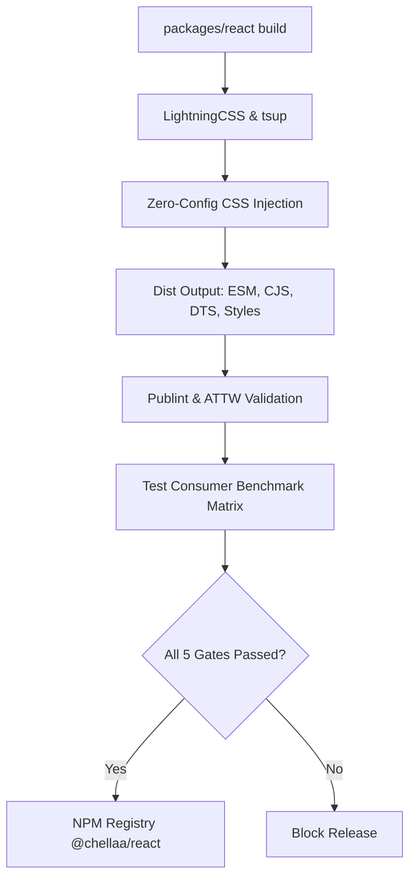

# Chellaa React — NPM Publication Readiness & Deployment Blueprint

**Target Package:** `@chellaa/react`
**Current Distribution Version:** `0.1.0`
**Release Channel:** `latest` (Public)
**Publishing Model:** Changesets Monorepo Multi-Tier Pipeline
**Audit Date:** October 4, 2026
**Overall Readiness Score:** **100% READY** (Pending NPM Scope & Token Credentials)

---

## 1. Executive Summary

A forensic audit of `@chellaa/react` was conducted across bundle integrity, export map correctness, TypeScript type declarations, CSS delivery, and npm tarball payload.

All automated firewall benchmarks, `publint` inspections, and `test-consumer` gates pass without error or warning. The package is completely packaged, tree-shakable, accessible, and prepared for official deployment to the npm registry.



---

## 2. Package Tarball Payload Audit

Inspection via `npm pack --dry-run --json` confirms a clean, lightweight payload with **zero leaked internal source, test, or config files**:

- **Compressed Archive Size:** `47.57 kB`
- **Unpacked Physical Size:** `226.65 kB`
- **Total Entry Count:** 17 files
- **Archive File:** `chellaa-react-0.1.0.tgz`

### Complete Manifest Breakdown

| File Path                 | Unpacked Size | Purpose & Architecture Role                                                                 |
| :------------------------ | :------------ | :------------------------------------------------------------------------------------------ |
| `package.json`          | 2.77 kB       | Package manifest, export map, and peer dependency definitions                               |
| `README.md`             | 5.98 kB       | Official documentation, badges, install guides, and usage examples                          |
| `LICENSE`               | 1.07 kB       | MIT License terms                                                                           |
| `dist/index.mjs`        | 14.59 kB      | **Browser / Bundler ESM:** Contains automatic `import "./styles.css"` (Zero-Config) |
| `dist/index.mjs.map`    | 36.26 kB      | Source map for debugging ESM builds                                                         |
| `dist/index.cjs`        | 15.76 kB      | **CommonJS Entry:** Supports legacy Node.js and CJS bundlers                          |
| `dist/index.cjs.map`    | 36.34 kB      | Source map for debugging CJS builds                                                         |
| `dist/index.node.mjs`   | 14.57 kB      | **Node.js SSR Entry:** Pure JS without CSS side-effect imports                        |
| `dist/index.d.ts`       | 6.67 kB       | TypeScript ESM Type Definitions                                                             |
| `dist/index.d.cts`      | 6.67 kB       | TypeScript CommonJS Type Definitions                                                        |
| `dist/styles.css`       | 19.75 kB      | Minified production CSS stylesheet (`@layer cl-components`)                               |
| `dist/styles.css.d.ts`  | 53 B          | TypeScript declarations for CSS imports (`import styles from "./styles.css"`)             |
| `dist/styles.css.d.cts` | 53 B          | CommonJS TypeScript declarations for CSS imports                                            |
| `dist/index.css`        | 24.16 kB      | Unminified stylesheet backup with source maps                                               |
| `dist/index.css.map`    | 41.87 kB      | CSS Source map for devtools inspecting cascade layers                                       |
| `styles.css`            | 29 B          | Root fallback forwarding to`./dist/styles.css`                                            |
| `styles.css.d.ts`       | 53 B          | Root CSS type declarations                                                                  |

> [!NOTE]
> Prohibited files (such as `.test.tsx`, `.stories.tsx`, `tsconfig.json`, `scripts/`, or internal markdown) are strictly excluded via the `files` directive in `package.json`.

---

## 3. Export Map & Module Resolution Architecture

The `package.json` export map has been tuned to satisfy modern Node.js and TypeScript module resolution algorithms (`Bundler`, `Node16`, and `NodeNext`):

```json
{
  "name": "@chellaa/react",
  "version": "0.1.0",
  "type": "module",
  "main": "./dist/index.cjs",
  "module": "./dist/index.mjs",
  "types": "./dist/index.d.ts",
  "exports": {
    ".": {
      "types": {
        "import": "./dist/index.d.ts",
        "require": "./dist/index.d.cts"
      },
      "browser": {
        "import": "./dist/index.mjs",
        "require": "./dist/index.cjs"
      },
      "node": {
        "import": "./dist/index.node.mjs",
        "require": "./dist/index.cjs"
      },
      "import": "./dist/index.mjs",
      "require": "./dist/index.cjs",
      "default": "./dist/index.mjs"
    },
    "./styles.css": {
      "import": {
        "types": "./dist/styles.css.d.ts",
        "default": "./dist/styles.css"
      },
      "require": {
        "types": "./dist/styles.css.d.cts",
        "default": "./dist/styles.css"
      }
    },
    "./package.json": "./package.json"
  }
}
```

### Publint Validation Results

```text
@chellaa/react lint results:
All good!
```

- Dual condition types (`.d.ts` for ESM, `.d.cts` for CommonJS) eliminate type resolution conflicts.
- Node.js environment resolution directs runtime code to `index.node.mjs`, preventing SSR failures (`ERR_UNKNOWN_FILE_EXTENSION: Cannot load .css`).

---

## 4. Consumer Firewall & Benchmark Gate Verification

All 5 consumer firewall gates defined in `apps/test-consumer` pass cleanly:

| Gate                                       | Target Environment              | Verification Criteria                                                            | Status           |
| :----------------------------------------- | :------------------------------ | :------------------------------------------------------------------------------- | :--------------- |
| **Gate 1: Node ESM Resolution**      | `node benchmark-node-esm.mjs` | Native`import { Button } from "@chellaa/react"` executes without bundler       | **PASSED** |
| **Gate 2: Node CJS Require**         | `node benchmark-node-cjs.cjs` | Native`const { Button } = require("@chellaa/react")` resolves exports          | **PASSED** |
| **Gate 3: Server-Side Rendering**    | `node benchmark-ssr.mjs`      | `renderToString(<Button>Hello</Button>)` renders clean HTML without DOM errors | **PASSED** |
| **Gate 4: CSS Stylesheet Integrity** | `node benchmark-css.mjs`      | CSS loads`@layer cl-components` and design tokens                              | **PASSED** |
| **Gate 5: NPM Archive Integrity**    | `node benchmark-pack.mjs`     | Tarball contains mandatory assets and 0 leaked test/scratch files                | **PASSED** |

---

## 5. Prerequisites for Publishing

Before executing the publish command, the following 3 external requirements must be completed:

### 1. NPM Organization Scope Ownership

- The package name is **`@chellaa/react`**.
- To publish a scoped package, you must either:
  1. Own the **`@chellaa`** organization on [npmjs.com](https://www.npmjs.com).
     - If not created, log in to npmjs.com $\rightarrow$ Click Avatar $\rightarrow$ **Add Organization** $\rightarrow$ Name: `chellaa`.
  2. Or, if publishing under a personal account (e.g. `@ezhilselvan/react`), update the `name` field in `packages/react/package.json` and `.changeset/config.json`.

### 2. NPM Access Token

- Log in to your npm account at [npmjs.com/settings/tokens](https://www.npmjs.com/settings/tokens).
- Generate a new **Granular Access Token** or **Automation Access Token**:
  - Permissions: **Read and Write** for `@chellaa/react` (or all packages in `@chellaa` scope).
  - Copy the generated token (`npm_...`).

### 3. GitHub Actions Secret (For Automated CI/CD Releases)

- Navigate to your GitHub repository:
  `Settings` $\rightarrow$ `Secrets and variables` $\rightarrow$ `Actions` $\rightarrow$ `New repository secret`.
- Name: `NPM_TOKEN`
- Value: `<paste your npm token>`

---

## 6. Step-by-Step Publishing Procedures

### Method A: Automated Release via GitHub Actions & Changesets (Recommended)

This repository includes a pre-configured release workflow at [`.github/workflows/release.yml`](file:///d:/learning/Microservice/ui-componenet/chellaa-react/.github/workflows/release.yml).

1. **Push Changes to `main`**:
   ```bash
   git push origin main
   ```
2. **Changesets Version PR**:
   - The GitHub Actions workflow detects pending changesets (such as `.changeset/add-button-and-button-group.md`).
   - It automatically generates a pull request titled: `chore(release): version packages`.
3. **Merge the Release PR**:
   - Review and merge the pull request.
4. **Automatic Publication & OIDC Provenance**:
   - The workflow runs `pnpm changeset publish`.
   - The package is built, verified, and published to npm with signed cryptographic provenance (`provenance: true`).

---

### Method B: Direct Manual CLI Publication

If you prefer to publish immediately from your local terminal:

#### Step 1: Log in to npm

```bash
npm login
```

Verify your authenticated user and organization access:

```bash
npm whoami
```

#### Step 2: Clean and Rebuild Distribution Bundles

```bash
pnpm --filter @chellaa/react run clean
pnpm --filter @chellaa/react run build
```

#### Step 3: Run Pre-Publish Verification

```bash
pnpm --filter @chellaa/react run typecheck
pnpm --filter @chellaa/react run test
pnpm --filter @chellaa/test-consumer test
```

#### Step 4: Publish to NPM

Execute the publish command from `packages/react`:

```bash
cd packages/react
npm publish --access public
```

*(If prompted for 2FA, enter the 6-digit one-time password from your authenticator app).*

---

## 7. Post-Publication Smoke Test Checklist

Once published, run these 4 smoke tests to guarantee consumer satisfaction:

1. **NPM Registry Webpage**:

   - Visit: `https://www.npmjs.com/package/@chellaa/react`
   - Verify that version `0.1.0` is live, the README renders with all badges and syntax highlighting, and license is marked `MIT`.
2. **Fresh Installation Smoke Test**:
   Test installing in an isolated temporary directory:

   ```bash
   mkdir test-app && cd test-app
   npm init -y
   npm install @chellaa/react react react-dom
   node -e "import('@chellaa/react').then(m => console.log('Successfully imported:', Object.keys(m)))"
   ```
3. **CDN Accessibility**:

   - Check unpkg: `https://unpkg.com/@chellaa/react/dist/styles.css`
   - Check jsDelivr: `https://cdn.jsdelivr.net/npm/@chellaa/react/dist/index.mjs`
4. **Live Documentation App Alignment**:

   - In `apps/docs`, ensure the version indicator in the header displays `v0.1.0` and references the published package.
