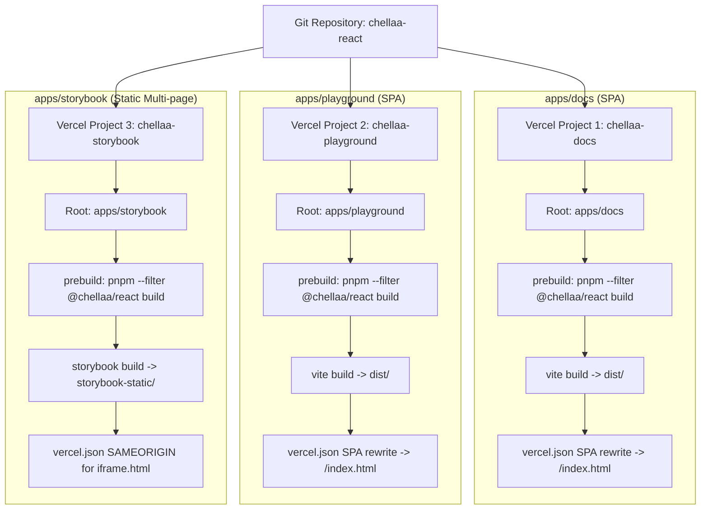

# Vercel Deployment Blueprint: Chellaa React Monorepo

This guide provides the complete, production-tested architecture and step-by-step instructions for deploying all applications in the Chellaa React monorepo to [Vercel](https://vercel.com):

1. **`@chellaa/docs`** (`apps/docs`): Official documentation portal with live previews and API specifications.
2. **`@chellaa/playground`** (`apps/playground`): Rapid component sandbox and theme prototyping tool.
3. **`@chellaa/storybook`** (`apps/storybook`): Visual testing and component design system workbench.

## Deployment Models Supported

This repository supports two Vercel deployment architectures:

1. **Option A (New Vercel Services Mode)**: A single Vercel project with multiple services defined in root [`vercel.json`](file:///d:/learning/Microservice/ui-componenet/chellaa-react/vercel.json), routed through unified paths on a single domain (`/`, `/playground`, `/storybook`).
2. **Option B (Classic Multi-Project Mode)**: Three distinct Vercel projects linked to individual root directories (`apps/docs`, `apps/playground`, `apps/storybook`) with separate subdomains.

---

## 1. Vercel Services Architecture (Single Project)

In Services mode, the root [`vercel.json`](file:///d:/learning/Microservice/ui-componenet/chellaa-react/vercel.json) defines each app as an independent service and routes incoming traffic via top-level rewrites:

```json
{
  "$schema": "https://openapi.vercel.sh/vercel.json",
  "services": {
    "docs": {
      "root": "apps/docs",
      "framework": "vite"
    },
    "playground": {
      "root": "apps/playground",
      "framework": "vite"
    },
    "storybook": {
      "root": "apps/storybook",
      "outputDirectory": "storybook-static",
      "buildCommand": "pnpm run build"
    }
  },
  "rewrites": [
    {
      "source": "/playground/(.*)",
      "destination": { "service": "playground" }
    },
    {
      "source": "/playground",
      "destination": { "service": "playground" }
    },
    {
      "source": "/storybook/(.*)",
      "destination": { "service": "storybook" }
    },
    {
      "source": "/storybook",
      "destination": { "service": "storybook" }
    },
    {
      "source": "/(.*)",
      "destination": { "service": "docs" }
    }
  ]
}
```

---

## 2. Multi-Project Architecture (Separate Subdomains)



---

## 2. Master Project Configuration Matrix

Configure each project in the [Vercel Dashboard](https://vercel.com/dashboard) with the exact parameters below:

| Configuration Setting | Docs (`apps/docs`) | Playground (`apps/playground`) | Storybook (`apps/storybook`) |
| :--- | :--- | :--- | :--- |
| **Project Name** | `chellaa-docs` | `chellaa-playground` | `chellaa-storybook` |
| **Root Directory** | `apps/docs` | `apps/playground` | `apps/storybook` |
| **Framework Preset** | `Vite` | `Vite` | `Other` (or `Storybook`) |
| **Build Command** | `pnpm run build` | `pnpm run build` | `pnpm run build` |
| **Output Directory** | `dist` | `dist` | `storybook-static` |
| **Install Command** | `pnpm install` | `pnpm install` | `pnpm install` |
| **Node.js Version** | `18.x` or `20.x` | `18.x` or `20.x` | `18.x` or `20.x` |

> [!NOTE]
> Every app's `package.json` contains `"prebuild": "pnpm --filter @chellaa/react build"`. When Vercel executes `pnpm run build`, npm/pnpm automatically triggers the `prebuild` hook first, ensuring the core design system engine (`@chellaa/react`) is always compiled before bundling.

---

## 3. Configuration Files Reference

### A. Docs (`apps/docs/vercel.json`)
Configures client-side routing fallback so deep links (e.g. `/components/button` or `/resources/changelog`) reload without `404: NOT_FOUND`:

```json
{
  "$schema": "https://openapi.vercel.sh/vercel.json",
  "cleanUrls": true,
  "trailingSlash": false,
  "headers": [
    {
      "source": "/assets/(.*)",
      "headers": [
        {
          "key": "Cache-Control",
          "value": "public, max-age=31536000, immutable"
        }
      ]
    }
  ],
  "rewrites": [
    {
      "source": "/(.*)",
      "destination": "/index.html"
    }
  ]
}
```

### B. Playground (`apps/playground/vercel.json`)
Configures SPA rewrite fallback and long-lived asset caching:

```json
{
  "$schema": "https://openapi.vercel.sh/vercel.json",
  "cleanUrls": true,
  "trailingSlash": false,
  "headers": [
    {
      "source": "/assets/(.*)",
      "headers": [
        {
          "key": "Cache-Control",
          "value": "public, max-age=31536000, immutable"
        }
      ]
    }
  ],
  "rewrites": [
    {
      "source": "/(.*)",
      "destination": "/index.html"
    }
  ]
}
```

### C. Storybook (`apps/storybook/vercel.json`)
Storybook is a multi-page static bundle containing `iframe.html`. A blind SPA rewrite to `/index.html` would break story isolation. This configuration serves files directly while permitting iframe embedding:

```json
{
  "$schema": "https://openapi.vercel.sh/vercel.json",
  "cleanUrls": true,
  "trailingSlash": false,
  "headers": [
    {
      "source": "/assets/(.*)",
      "headers": [
        {
          "key": "Cache-Control",
          "value": "public, max-age=31536000, immutable"
        }
      ]
    },
    {
      "source": "/(.*)",
      "headers": [
        {
          "key": "X-Frame-Options",
          "value": "SAMEORIGIN"
        }
      ]
    }
  ]
}
```

---

## 4. Environment Variables & Cross-Linking

The documentation site dynamically resolves outbound links to Storybook and the Playground using Vite environment variables.

In the **`chellaa-docs`** project settings on Vercel (`Project Settings` > `Environment Variables`), configure:

| Variable Name | Production Value Example | Purpose |
| :--- | :--- | :--- |
| `VITE_STORYBOOK_URL` | `https://chellaa-storybook.vercel.app` | Links "Open in Storybook" buttons directly to your deployed Storybook instance |
| `VITE_PLAYGROUND_URL` | `https://chellaa-playground.vercel.app` | Links header & footer icons directly to your deployed Playground sandbox |

> [!TIP]
> If these variables are not configured in Vercel, the app automatically defaults to `http://localhost:6006` and `http://localhost:5173` for safe local development.

---

## 5. Step-by-Step Vercel Dashboard Deployment

### Step 1: Push Code to Git (GitHub/GitLab/Bitbucket)
Push the current repository branch to your remote repository:
```bash
git push origin main
```

### Step 2: Deploy Project 1 (`chellaa-docs`)
1. In Vercel, click **Add New...** > **Project**.
2. Select your repository.
3. In **Project Name**, enter: `chellaa-docs`.
4. In **Root Directory**, click **Edit** and choose `apps/docs`.
5. In **Framework Preset**, select **Vite**.
6. Expand **Environment Variables** and add:
   - `VITE_STORYBOOK_URL` = `https://<your-storybook-project>.vercel.app`
   - `VITE_PLAYGROUND_URL` = `https://<your-playground-project>.vercel.app`
7. Click **Deploy**.

### Step 3: Deploy Project 2 (`chellaa-playground`)
1. Click **Add New...** > **Project**.
2. Select the **same** repository.
3. In **Project Name**, enter: `chellaa-playground`.
4. In **Root Directory**, select `apps/playground`.
5. In **Framework Preset**, select **Vite**.
6. Click **Deploy**.

### Step 4: Deploy Project 3 (`chellaa-storybook`)
1. Click **Add New...** > **Project**.
2. Select the **same** repository.
3. In **Project Name**, enter: `chellaa-storybook`.
4. In **Root Directory**, select `apps/storybook`.
5. In **Framework Preset**, select **Other**.
6. In **Build Command**, enter: `pnpm run build`.
7. In **Output Directory**, enter: `storybook-static`.
8. Click **Deploy**.

---

## 6. Turborepo Build Cache & Ignore Optimization

To save build minutes and avoid deploying apps that haven't changed:

In each project's **Settings** > **Git** > **Ignored Build Step**:
- Select **Custom**.
- Command:
  ```bash
  npx turbo-ignore
  ```

`turbo-ignore` analyzes Git commits and skips the build if the app and its dependencies (like `@chellaa/react`) have no modifications.

---

## 7. Alternative: Deploy via Vercel CLI

If you prefer deploying from your terminal using `vercel-cli`:

### Deploy Docs:
```bash
cd apps/docs
vercel
# Follow prompts: Link existing project or create 'chellaa-docs'
vercel --prod
```

### Deploy Playground:
```bash
cd apps/playground
vercel
# Follow prompts: Create 'chellaa-playground'
vercel --prod
```

### Deploy Storybook:
```bash
cd apps/storybook
vercel
# Follow prompts: Create 'chellaa-storybook'
# Set output directory: storybook-static
vercel --prod
```

---

## 8. Verification & Pre-flight Checklist

- [x] **Monorepo Build Pipelines Tested**: `pnpm run build:docs`, `pnpm run build:playground`, and `pnpm run build:storybook` build with exit code 0.
- [x] **Isolated App Prebuilds Tested**: `pnpm run build` in each subfolder automatically builds `@chellaa/react` first.
- [x] **SPA Routing Rewrites**: `apps/docs/vercel.json` and `apps/playground/vercel.json` configured for client-side routing.
- [x] **Storybook Static Assets**: Multi-page output configured to `storybook-static` with iframe headers.
- [x] **Turbo Cache Integration**: `turbo.json` outputs include `"storybook-static/**"`.
- [x] **Environment Variables**: Dynamic cross-app URL resolution implemented with local fallbacks.
