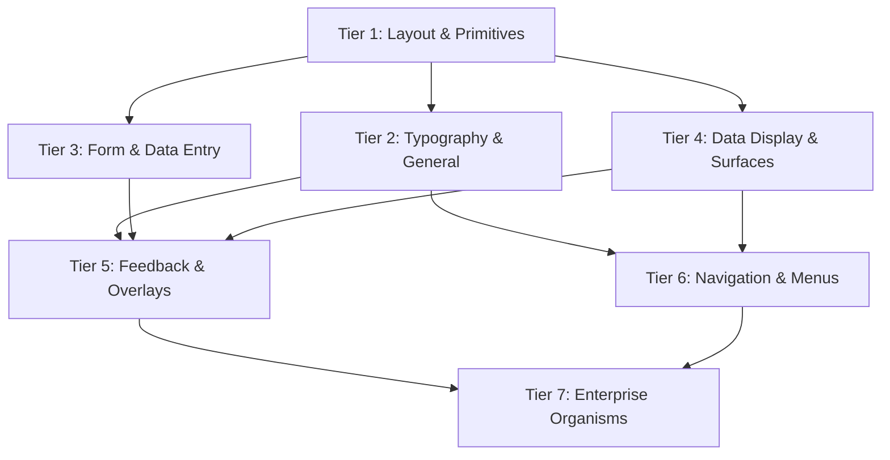

# Chellaa React: Master Component Architecture & Implementation Roadmap

> **Role**: Senior Lead Software Architect & Principal Design Systems Engineer  
> **Workspace**: `@chellaa/react` Monorepo  
> **Status**: Active Architecture Blueprint & Specification Standard  

---

## 1. Executive Synthesis: Ant Design vs. MUI vs. Chellaa React

Both **Ant Design** and **Material UI (MUI)** are industry standards, but they solve design and engineering challenges differently:

| Metric | Ant Design (AntD) | Material UI (MUI) | Chellaa React Architecture |
| :--- | :--- | :--- | :--- |
| **Design Philosophy** | Enterprise data density, structured workflows, desktop-first | Material Design guidelines, mobile-first, tactile elevations | **Universal Design Engine**: Modern, minimalist, clean ergonomics with high enterprise density support |
| **Styling Mechanism** | CSS-in-JS (AntD v5 `@ant-design/cssinjs`) / Less (v4) | CSS-in-JS (`@emotion/styled`, Pigment CSS, or Joy UI) | **Zero-Runtime CSS Variables (`--cl-*`)**: Compile-time LightningCSS, zero JS runtime overhead, instant theme switching |
| **Composition** | Pre-bundled monolithic components with internal wrappers | Atomic primitives (`Box`, `Stack`, `Slot`, unstyled base) | **Radix-style `asChild` Slot primitive**: Zero DOM pollution, seamless integration with Next.js/React Router `Link` |
| **State Management** | Internal controlled/uncontrolled state machines | `useControlled` hook with standard event emitters | **`useControllableState`**: Strict single-source-of-truth support with graceful uncontrolled defaults |
| **Accessibility** | ARIA attributes built-in; historically slower on WCAG keyboard traps | Strong WAI-ARIA foundations with accessibility-focused props | **First-Class WCAG 2.1 AA / AAA**: Strict automated `vitest-axe` testing, keyboard navigation, high-contrast support |

### The Chellaa React Value Proposition
Chellaa React merges the **rich, enterprise-grade capabilities of Ant Design** (data tables, form validation, nested trees, modals, message systems) with the **modern, composable, lightweight ergonomics of MUI and Radix UI** — completely powered by zero-runtime CSS tokens.

---

## 2. Master Component Taxonomy Matrix (7 Unified Tiers)

Below is the master categorization harmonizing all Ant Design and MUI components into logical architecture tiers:



### Tier 1: Layout Foundations & Headless Primitives
The bedrock for page composition, spacing, and DOM alignment:
- **`Box`**: Universal polymorphic HTML container with token-aware style props.
- **`Flex` / `Stack`**: 1D layout container (Row / Column) with gap, alignment, and auto-margins.
- **`Grid`**: 2D CSS grid container with fractional tracks, minmax, and responsive columns.
- **`Container`**: Max-width layout wrapper with horizontal centering and fluid gutters.
- **`Divider`**: Semantic horizontal/vertical line with optional label/chip alignment.
- **`Space`**: Inline flow container with dynamic spacing between child elements.
- **`Portal`** *(Already Implemented)*: Escapes DOM hierarchy to `document.body` for overlays.
- **`Slot`** *(Already Implemented)*: Zero-wrapper element composition (`asChild`).

### Tier 2: General & Typography
The fundamental brand and interactive elements:
- **`Button`** *(Already Implemented)*: 5 variants, 5 sizes, 6 color schemes, `asChild`, loading states.
- **`ButtonGroup`** *(Already Implemented)*: Segmented and attached button grouping with shared props.
- **`IconButton` / `FloatButton`**: Square/circular icon action button; floating action button (FAB).
- **`Typography` (`Text`, `Heading`, `Paragraph`, `Code`, `Kbd`)**: Strict typographic scale, line clamps, truncate, semantic heading levels (`h1`-`h6`), keyboard shortcuts.
- **`Link`**: Accessible inline link with external indicator and router delegation.

### Tier 3: Form & Data Entry
Enterprise form inputs with full two-way binding, error states, and keyboard controls:
- **`Input` / `InputGroup`**: Single-line text input with prefix/suffix addons, clear button, and password reveal.
- **`Textarea`**: Multi-line expandable text area with autosize options.
- **`Checkbox` / `CheckboxGroup`**: Accessible tri-state checkbox (checked, unchecked, indeterminate).
- **`Radio` / `RadioGroup`**: Accessible single-choice group with roving tabindex.
- **`Switch`**: Semantic toggle switch for boolean states with optional icons/labels.
- **`Select` / `MultiSelect`**: Single & multi-item dropdown with search filtering, virtualized list, and chip tags.
- **`Slider` / `RangeSlider`**: Single and dual-thumb numeric slider with tooltip values and tick marks.
- **`InputNumber`**: Controlled numeric input with increment/decrement steppers and precision clamping.
- **`FormField`**: Layout wrapper binding `Label`, `Control`, `HelperText`, and `ErrorMessage` via ARIA IDs.
- **`Form`**: Form context provider managing submission, dirty states, and validation schemas.

### Tier 4: Data Display & Surfaces
Presenting structured information, metadata, and visual hierarchy:
- **`Card`**: Elevated/bordered container with header, media, body, and footer slots.
- **`Paper` / `Surface`**: Flat, outlined, or elevated background surface with rounded corners.
- **`Badge`**: Numeric or status dot badge positioned relative to child elements.
- **`Tag` / `Chip`**: Compact labeled tag with dismissible delete button and color schemes.
- **`Avatar` / `AvatarGroup`**: Image, initials, or icon user avatar with fallbacks and stack overlap.
- **`Tooltip`**: Floating hover/focus text tooltip with arrow, collision detection, and delay timings.
- **`Popover`**: Floating interactive content triggered by click or hover.
- **`Accordion` / `Collapse`**: Collapsible vertical disclosure panels (single or multi-expand).
- **`List` / `ListItem`**: Structured list with icons, avatars, action slots, and dividing lines.
- **`Statistic`**: Highlighted numeric metric with label, prefix, suffix, and trend indicators.
- **`Timeline`**: Chronological event list with status nodes, icons, and connecting tracks.
- **`Empty`**: Zero-data placeholder state with illustration, title, and call-to-action button.

### Tier 5: Feedback & Overlays
Communicating state, alerts, blocking actions, and transient updates:
- **`Alert`**: Prominent in-page notice with info, success, warning, error variants and action slot.
- **`Spinner`**: Animated SVG loading indicator with customizable stroke and speed.
- **`Progress`**: Linear and circular progress bars with determinate/indeterminate states.
- **`Skeleton`**: Content placeholder shimmer animation for text, circles, and rectangular cards.
- **`Modal` / `Dialog`**: Accessible modal overlay with focus trap, backdrop blur, ESC dismissal, and header/footer.
- **`Drawer`**: Sliding panel from left/right/top/bottom screen edge with backdrop.
- **`Toast` / `Notification`**: Imperative and hook-based transient notification system with auto-dismiss.
- **`Popconfirm`**: Compact confirmation dialog anchored to a trigger button (AntD style).
- **`Result`**: Full-page/card status screen (404, 500, success, forbidden) with action buttons.

### Tier 6: Navigation & Multi-step
Guiding users through information hierarchy and sequential tasks:
- **`Tabs`**: Tabbed interface with keyboard arrow navigation, indicator animations, and lazy-loading panels.
- **`Breadcrumb`**: Hierarchical trail of links indicating the current page location.
- **`Menu` / `Dropdown`**: Context menu and cascading dropdown with submenus, shortcuts, and divider items.
- **`Pagination`**: Page navigation with page size selector, jumper input, and ellipsis truncation.
- **`Steps` / `Stepper`**: Multi-step process indicator (horizontal/vertical) with completed/active/error states.
- **`Segmented`**: Segmented pill control for switching between a compact set of view options.

### Tier 7: Complex Enterprise Organisms
Advanced interactive components for intensive data applications:
- **`Table`**: Enterprise data grid with sorting, multi-column filtering, selection checkboxes, pagination, fixed headers, and column resizing.
- **`DatePicker` / `DateRangePicker`**: Calendar popup with month/year navigation, quick presets, and timezone handling.
- **`Autocomplete`**: Predictive text input with asynchronous search and highlight matches.
- **`Transfer`**: Double-column item transfer list with search and batch actions.
- **`Tree` / `TreeSelect`**: Hierarchical expandable tree view with checkboxes and drag-and-drop.

---

## 3. The Universal Component Architecture Standard (6 Pillars)

Every component created in `@chellaa/react` MUST adhere to this strict engineering contract:

```
[Component Directory]
  ├── [Component].tsx          # Component implementation with forwardRef & JSDoc
  ├── [Component].test.tsx     # Vitest unit tests (render, events, a11y axe)
  ├── [Component].stories.tsx  # Storybook story definitions with controls & variants
  ├── [Component].css          # Component-scoped CSS using zero-runtime --cl-* variables
  └── index.ts                 # Clean public export of Component, types, and sub-components
```

### Pillar 1: Polymorphism & Zero-DOM Composition (`asChild`)
Components must never force unwanted wrapper `<div>` or `<span>` elements:
- Accept `asChild?: boolean`.
- When `asChild=true`, compose attributes, classes, and ref onto the child element using `Slot`.
- Allows instant conversion into Next.js `<Link>`, Remix `<Link>`, or custom router anchors.

### Pillar 2: Dual State Model (`useControllableState`)
All value-holding components (Input, Checkbox, Switch, Tabs, Accordion, Modal) must support:
- **Controlled mode**: `value` / `checked` / `isOpen` + `onChange` / `onOpenChange`.
- **Uncontrolled mode**: `defaultValue` / `defaultChecked` / `defaultOpen`.
- Uses internal [`useControllableState`](file:///d:/learning/Microservice/ui-componenet/chellaa-react/packages/react/src/hooks/useControllableState.ts) hook to prevent state desynchronization.

### Pillar 3: Accessibility & WAI-ARIA 1.2 Compliance
- Every interactive element has appropriate `role`, `aria-*` attributes (`aria-expanded`, `aria-controls`, `aria-invalid`, `aria-describedby`).
- Full keyboard navigation: `Enter`, `Space`, `ArrowUp`/`ArrowDown`, `Escape`, `Tab`.
- Automated test assertions with `expect(await axe(container)).toHaveNoViolations()`.

### Pillar 4: CSS Custom Property Tokens Interface (`--cl-*`)
- Zero inline styles for aesthetics.
- Styling isolated in scoped classes with fallbacks:
  ```css
  .cl-input {
    background: var(--cl-input-bg, var(--cl-color-bg-surface));
    border: 1px solid var(--cl-input-border, var(--cl-color-border-subtle));
    color: var(--cl-input-text, var(--cl-color-text-primary));
    transition: all var(--cl-duration-normal) var(--cl-easing-standard);
  }
  ```
- Allows global theme overrides without specificity wars (`!important`).

### Pillar 5: Standardized Variant & Size Matrix
All components share a consistent prop vocabulary:
- **Sizes**: `"xs" | "sm" | "md" | "lg" | "xl"` (Default: `"md"`).
- **Variants**: `"solid" | "outline" | "ghost" | "subtle"` (Component-tailored).
- **Color Schemes**: `"primary" | "secondary" | "neutral" | "success" | "warning" | "danger"`.

### Pillar 6: Strict TypeScript Typing & Clean Exports
- All component prop interfaces extend standard HTML element attributes:
  ```ts
  export interface InputProps extends Omit<React.InputHTMLAttributes<HTMLInputElement>, "size"> {
    size?: InputSize;
    variant?: InputVariant;
    isInvalid?: boolean;
    isDisabled?: boolean;
    startAddon?: React.ReactNode;
    endAddon?: React.ReactNode;
  }
  ```
- All types and sub-components explicitly exported from `src/index.ts`.

---

## 4. Design System Tokens: Plug-and-Play Contract

When you provide custom design systems later, `@chellaa/react` will ingest them via CSS variables without requiring code changes to the components. 

The token contract is divided into two layers:

### Layer A: Global Design Tokens ([`tokens.css`](file:///d:/learning/Microservice/ui-componenet/chellaa-react/packages/react/src/styles/tokens.css))
1. **Color Scales**: Neutral (50-950), Primary (50-950), Success, Warning, Danger, Info.
2. **Spacing Scale**: 16-point scale (`--cl-space-1`: 0.25rem to `--cl-space-24`: 6rem).
3. **Typography**: Font family, font sizes (`xs` to `5xl`), font weights (`400`, `500`, `600`, `700`), line heights.
4. **Radii**: `--cl-radius-none`, `sm` (4px), `md` (6px), `lg` (8px), `xl` (12px), `full` (9999px).
5. **Shadows**: `--cl-shadow-xs`, `sm`, `md`, `lg`, `xl`, `inner`.
6. **Transitions**: Durations (`fast`: 150ms, `normal`: 200ms, `slow`: 300ms) + Easings.
7. **Z-Indices**: `--cl-z-dropdown` (1000), `--cl-z-sticky` (1100), `--cl-z-modal` (1300), `--cl-z-toast` (1500).

### Layer B: Semantic Component Tokens ([`theme.css`](file:///d:/learning/Microservice/ui-componenet/chellaa-react/packages/react/src/styles/theme.css))
Tokens mapped to semantic roles that adapt automatically between light and dark modes:
- `--cl-color-bg-canvas`, `--cl-color-bg-surface`, `--cl-color-bg-subtle`
- `--cl-color-text-primary`, `--cl-color-text-secondary`, `--cl-color-text-dim`
- `--cl-color-border-subtle`, `--cl-color-border-strong`
- Focus ring: `--cl-ring-color`, `--cl-ring-offset`

---

## 5. Phased Implementation Roadmap (Sprint Plan)

To build this systematically without code bloat or circular dependencies, components will be implemented in 6 sequential waves:

```
[Phase 1: Layout & Typography Foundations]
  ├── Box, Flex, Stack, Grid, Container, Divider
  └── Text, Heading, Link, Kbd

[Phase 2: Core Form & Data Entry Primitives]
  ├── Input, Textarea, FormField (Label, HelperText, ErrorMessage)
  └── Checkbox, Radio/RadioGroup, Switch

[Phase 3: Surfaces & Visual Data Display]
  ├── Card, Paper, Badge, Tag/Chip, Avatar
  └── Tooltip, Accordion/Collapse, List, Empty

[Phase 4: Feedback & Interactive Overlays]
  ├── Spinner, Progress, Skeleton, Alert
  └── Modal/Dialog, Drawer, Toast Notification system

[Phase 5: Navigation & Rich Controls]
  ├── Tabs, Breadcrumb, Menu/Dropdown, Pagination
  └── Select, Slider, InputNumber, Segmented

[Phase 6: Advanced Enterprise Organisms]
  ├── Data Table (Sorting, Filtering, Pagination, Selection)
  ├── DatePicker & DateRangePicker
  └── Autocomplete, Stepper, Transfer, Tree
```

---

## 6. Definition of Done: Per-Component Delivery Checklist

For every component implemented in the waves above, the following 5 assets are delivered simultaneously:

- [ ] **1. React Component Implementation**: Clean TypeScript, `forwardRef`, `asChild` composition, zero-runtime CSS.
- [ ] **2. CSS Token Stylesheet**: Scoped BEM-like classes using `--cl-*` variables with light/dark theme support.
- [ ] **3. Vitest Unit & Accessibility Test Suite**: 100% core branch coverage + automated `vitest-axe` validation.
- [ ] **4. Storybook Story**: Comprehensive interactive story with Controls table, all variants, sizes, and states.
- [ ] **5. Interactive Documentation Portal Page**: Live editable sandbox, API props specification table, and copyable install snippets.
